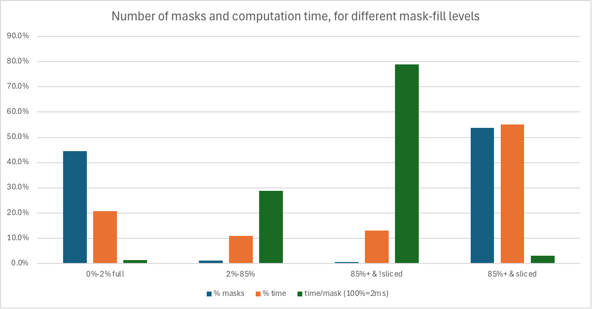

# What makes LLGuidance go fast?

The main operation when computing a token mask is walking the [tokenizer trie](./toktrie.md).
The trie is laid flat in memory, and just walking it is highly optimized,
with minimal branch mis-predictions.
When doing simple execution of regular expression automaton on the trie,
on AMD EPYC visiting one trie node takes about 13 cycles.
This is likely [close to optimal](./toktrie.md#actual-code).

For a tokenizer with `n_vocab` tokens, the trie typically has around `2 * n_vocab` nodes.
Thus, for 128k llama3 tokenizer, for EPYC running at 2 GHz,
we get around 1.5ms to compute the token mask for a simple regular expression.
In other words, the baseline is relatively fast.

## CFGs and lexer/parser split

To make this work for more complex grammars, we use the following:

- [derivre](https://github.com/microsoft/derivre), a derivative-based regular expression engine,
  which can construct automaton lazily, with very low startup cost
- a highly optimized
  [Earley parser](https://en.wikipedia.org/wiki/Earley_parser)
  for context-free grammars (CFGs)
  on top of the lexer defined with regular expressions

As for the lexer/parser split:
Back in the 1970s when computers were slow, people figured out that one can
first deal with words
(also called tokens (not be confused with LLM tokens) or lexemes)
and only then one deals with syntax.
This is because splitting text into words is cheaper than parsing it.
And so regular expressions were used for "lexing"
(splitting into words or lexemes) and context-free grammars were
used for the higher-level parsing.
Now, this is theoretically unnecessary, since regular languages are
subset of context-free languages.
It's just that doing lexing first and parsing on top of larger items just
happens to be quite a bit faster.
While computers are much faster now, the token masking is this specific problem where one has to do lots of parsing in a very short time.

Also, virtually all programming language definitions (including JSON)
have this lexer/parser separation.

Typically the LLM tokens are somewhat aligned with lexemes,
meaning that when walking the trie,
the parser needs to be involved in processing under 0.5% of trie nodes,
leaving the rest to the lexer.

As a consequence, walking the trie with a CFG is almost as fast as walking it with a regular expression.

## Lexer construction

The lexer is based on the `derivre` library, which uses regular expression derivatives.
For basic introduction see
[Regular-expression derivatives reexamined](https://www.khoury.northeastern.edu/home/turon/re-deriv.pdf).
The derivative `d(L, c)` of a language (set of strings) `L` with respect to a character `c`,
is the set of words that start with `c` in `L`, with `c` removed, ie. `{ s | cs ∈ L }`.
For example, `d([ab][cd], a) = [cd]`, `d([ab]+, a) = [ab]*`, `d([ab], a) = ε`, `d([ab]c, c) = ∅`
(note that `∅` is an empty set, i.e., a regular expression that matches nothing,
while `ε` is empty string regular expression, which matches the word of length 0).
Derivatives can be defined recursively for regular expressions,
for example `d(R|Q, a) = d(R, a) | d(Q, a)`.
A regular expression is _nullable_ if it can match an empty string.

The regular expressions correspond to states of a DFA
(deterministic finite automaton),
while the derivatives correspond to transitions.
State is accepting if the regular expression is nullable.
The `derivre` library constructs such a DFA lazily, by caching derivatives.
The regular expressions can be simplified using algebraic laws,
reducing the number of states in the DFA.
While the DFA is not minimal, it is typically much smaller
(depending on simplification used) than the
un-minimized DFA resulting from standard determinization of an NFA.

The lexer puts regular expressions for all lexemes in a hash-consed
expression set, with a single derivative cache (also hash-based).
The states of the lexer are sets of regular expressions, indexed
with lexeme index.
They are semantically equivalent to the alternative of the regular
expressions, but we use indices to keep track of them separately,
so the lexer can say which lexeme was recognized.

For a given lexer state `{ (l0, R0), (l1, R1), ..., (ln, Rn) }`
(where `li` is lexeme index and `Ri` is regular expression),
the state after transition via byte `c` is defined as
`{ (li, d(Ri, c)) | 0 ≤ i ≤ n when d(Ri, c) ≠ ∅ }`.
For every lexer state, we can see which lexemes are still possible in that state.
These states and transitions are cached in a simple table (no hashing).
Walking the trie mostly involves successful lookups in that table,
and the derivative engine is only used when the table doesn't yet have the
given transition.


## Earley parser optimizations

- CFG rules are stored in a flat array
- Earley items are indices into this array (dot position), and into Earley row array
- after an Earley row is computed, we determine which lexemes (terminals) are
  allowed in the current state; then we setup the lexer to only recognize these lexemes;
  thus the lexer only processes lexemes that are relevant in a given state
- when walking down the token trie, rows are added to the parser state (pushed)
  when a lexeme is scanned,
  and when coming back up, rows are popped;
  we do not actually pop the rows, but just move a pointer, and if we're
  about to scan a lexeme, we check if it is the same as previously pushed
  lexeme - in that case the row can be reused and doesn't have to re-computed;
  this happens very often

## Slicer optimization

Generally, computing almost empty token masks is cheap.
This is because if the lexer or parser don't allow a given byte
in the trie, the entire sub-tree can be skipped.
Thus, for example, a token mask resulting from a regular expression defining
integers is quite quick to compute (as it has only number tokens in it).

However, large masks are slower to compute.
They typically happen inside of a relatively unconstrained context in the grammar.
For example, inside of JSON string, or a comment in a programming language.

We thus define a series _slices_, under-approximation of such unconstrained contexts.
The slices are defined by regular expressions typically of the form `[...]{1,N}`
(that is a character class repeated up to `N` times).

For example, a good set of slices for JSON schemas is 

- `[^"\\\x00-\x1F\x7F]{1,10}` (`turtle`, ` turtle`, `)!;`, `żółw`, `🐢`, etc.)
- `[^"\\\x00-\x1F\x7F]{1,30}` (`/////////////////`, ...)
- `[^"\\\x00-\x1F\x7F]+` (`-------------------------------------`, ...)
- everything else (`"`, `":`, `\`, `\u00`, partial UTF-8, newline, etc.); this one is implicit

They all exclude `"`, `\`, and ASCII control characters, all of which have to
be escaped in JSON strings.
The first one puts a length limit of `10`, the second relaxes it to `30`,
and the third one catches any remaining lengths of JSON-like strings,
while the implicit fourth one catches everything else.
The length limits make the slice apply for strings with `maxLength` of at least
10 (or 30).

We go through each slice in the definition order,
and for each claim all tokens that match the regular expression of the slice,
and build a token trie for them.
The final slice is implicitly defined as the remainder of the tokens.
Thus, each token is only present in one slice (and thus one token trie and one corresponding mask).

Also, an equivalent set of the above set of slices is:

```regex
[^"\\\x00-\x1F\x7F]{1,10}
[^"\\\x00-\x1F\x7F]{11,30}
[^"\\\x00-\x1F\x7F]{31,}
```

When computing the mask,
we check if the slice is completely contained in any of the currently allowed lexemes.
That is, we check if the lexer will allow all tokens in the slice.
If that is the case, we add the corresponding mask, and skip walking the trie of the slice.
Otherwise, we walk the trie as usual.

For example, at some position in a JSON scheme,
it may allow `"foo"`, `"bar"` and `"C*"` where C is defined as
`([^\"\\\x00-\x1F\x7F]|\\([\"\\\/bfnrt]|u[a-fA-F0-9]{4}))`.
Here, our JSON slice `[^"\\\x00-\x1F\x7F]{1,30}` is not contained
in any of the allowed lexemes (because of the initial quote).
After scanning token corresponding to the opening quote `"`,
the lexer will allow `foo"`, `bar"` and `C*"`.
Now, the JSON slice is contained in `C*"`,
and thus we can skip walking the trie for the slice.

Another example:
- assume schemas has `{ "type": "string", "maxLength": 20 }`
- so after initial quote, the lexer allows `C{0,20}"`
- the JSON slice `[^"\\\x00-\x1F\x7F]{1,10}` is contained in this lexeme,
  while `[^"\\\x00-\x1F\x7F]{11,30}` is not

This optimization make the mask computation about 10x faster in [MaskBench](https://github.com/guidance-ai/jsonschemabench/tree/main/maskbench).

The reason the optimization works, is that masks tend be either small or sliceable.
Here are statistics of various kinds of masks, across around 2M masks in MaskBench,
categorized based on how "full" the mask is and whether the slicer optimization was applied.

| Category            |  % Masks |    % Time | Time/Mask [us] |
|---------------------|---------:|----------:|---------------:|
| 0%-2% & !sliced     |    44.6% |     20.7% |             28 |
| 2%-85% & !sliced    |     1.1% |     11.0% |            576 |
| 85%+ & !sliced      |     0.5% |     13.0% |           1577 |
| 85%+ & sliced       |    53.8% |     55.0% |             61 |
| **Total**           |   100.0% |    100.0% |             60 |



A little under half of masks are very small (up to 2% of the tokens are allowed),
and in a little over half the slicer optimization can be applied
(there are no masks under 85% full where the slicer can be applied).
The remaining sliver of masks are either intermediate size or large, but the slicer optimization can't be applied; they take disproportionately long time to compute.

### Checking regex containment

This is an under-approximation of the containment problem,
that is it may return false when the containment is actually true.
If any of the "checks" fail, we return false.

Prefixes of language `R`, are defined as `P(R) = { w | ∃q. wq ∈ R }`.

We need to check if regex `S` (slice) is contained in prefix of regex `L` (lexeme): `S ⊆ P(L)`.

We check if `L` is of the form `(X{m,n} & ~E) T`, where 
`E` is of the form `E0 | E1 | ... | Ek`,
and both `E` can be `∅` (empty-set/no match) and `T` can be `ε` (empty string).

Observe that `P(R) ⊆ P(RT)`, ie. making regex longer doesn't remove any prefixes (provided `T ≠ ∅`).
Thus, we'll be checking containment in `P(X{m,n} & ~E)`.

We (over)estimate maximum length of `E`, let `o >= max { |w| | w ∈ E }`.
We check that `n > o`, and that `∃v ≠ ε. v ∈ X`.
In other words, we check that for anything matching `Ei` and `X{m,n}` there is a proper extension of that string in `X{m,n}`.

Now, we prove that `P(X{m,n} & ~E) = P(X{m,n})`.

Consider `w ∈ P(X{m,n})`. We have `wq ∈ X{m,n}` for some `q`.
If `|wq| > o`, then `wq ∉ E`, and thus `wq ∈ X{m,n} & ~E`.
Otherwise, `wq ∈ X{p}` for some `p <= o < n`,
and thus `wqv...v ∈ X{n}` for `n-p` repetitions of `v`.
We also have `|wqv...v| > o`, and thus `wqv...v ∉ E`,
and thus `wqv...v ∈ X{m,n} & ~E`,
and thus `w ∈ P(X{m,n} & ~E)`.
The other direction is trivial.

Now, we just need to check if `S ⊆ P(X{m,n})`.

First, we check if `S` is of the form `Y{m',n'}`.
Then, we check if `Y` is contained in `X` (this is a cached check using symbolic derivatives; it's typically simple).
Finally, we check if `n' <= n`.
Note that we don't care about `m` and `m'`, as we're checking for prefixes.

Also note that the upper-bound in the above calculations can be infinity.
